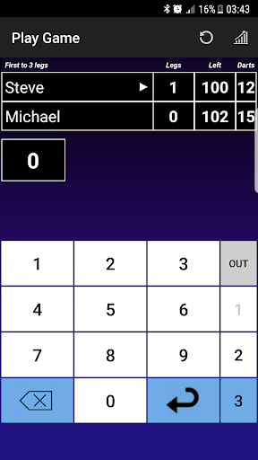
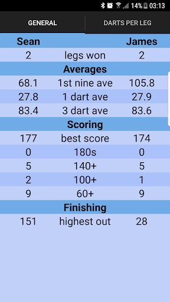
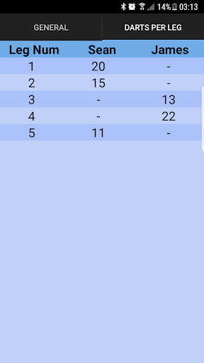
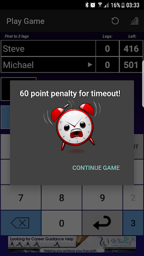

# Darts Scorer — Android

**An Android darts scoring application I developed in 2015.**

This project is one of my earlier substantial software projects. I built it as a fully functioning Android application for managing darts matches, scoring games, tracking players, and recording performance statistics.

The project is preserved on GitHub as a snapshot of my development work from 2015.

## Screenshots

The screenshots below are from the original application and were recovered from the Google Play Store listing.

They are included to give an idea of the application's interface and functionality as it appeared when the application was originally published.

### Score input screen 

### Statistics

### Darts thrown per leg stats

### Time out functionality (if timer goes to zero before player throws they see this dialog)

## About

The application was designed to provide a complete darts scoring experience rather than simply calculating a score.

It included player management, match and leg handling, persistent statistics, a CPU opponent, configurable game settings, and the ability to resume games.

## Features

* 🎯 Darts scoring and checkout validation
* 👥 Player management
* 🤖 CPU opponent
* 📊 Player and match statistics
* 💾 Persistent data using SQLite
* 🔄 Resume saved games
* ⏱️ Optional timer mode
* 🏆 Match and leg tracking
* 📈 Scoring statistics including 60+, 100+, 140+ and 180 scores
* 🎮 Configurable game settings
* 🔊 In-game sound effects
* 📱 Android UI with multiple screens and layouts

## Technology

* **Java**
* **Android**
* **SQLite**
* Android `SharedPreferences`
* Android layouts/resources
* Android activities and UI components

## Project Structure

The original application consisted of several components responsible for different parts of the application, including:

* Game play and scoring
* Game setup
* Player management
* Database management
* Player statistics
* Game statistics
* Statistics screens
* Android resources and layouts

The main game implementation contains the core scoring and game-state logic.

## Statistics

The application recorded a range of player performance information, including:

* Legs played
* Legs won
* Darts thrown
* Points scored
* 60+ scores
* 100+ scores
* 140+ scores
* 180s
* Average scoring performance
* Checkout information

## Development Notes

This application was developed in **2015**, so the code reflects the Android development practices and my programming experience at that time.

The architecture is not representative of how I would structure a project today. Some responsibilities are tightly coupled within the Android activities, particularly around game state, UI and application logic.

Rather than rewriting the original project, I have kept it largely intact as a record of an earlier stage of my development.

That makes the project useful to me as a reference point for how my approach to software development has evolved over time.

## Current Status

**Archived / Historical Project**

This project is no longer actively maintained.

It is preserved as an example of an earlier Android application I developed and as part of my programming history.

## What I Learned

Building this application gave me practical experience with:

* Designing and building an application from scratch
* Android application development
* Managing complex application state
* Working with databases and persistent data
* Implementing domain-specific business logic
* Designing multi-screen user interfaces
* Managing player and game data
* Building statistical functionality
* Handling different application states and user flows

## Looking Back

This was one of my earlier attempts at building a reasonably complete application rather than a small programming exercise.

The code and architecture have obvious limitations when viewed from a modern perspective, but the project represents an important stage in my development as a programmer.

**2015 — Android / Java / SQLite**

*An early project, preserved as part of my development history.*
